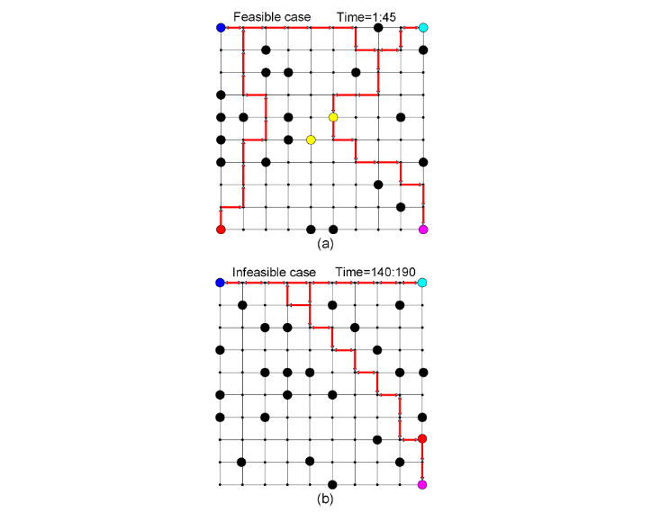

## Description

This package contains implementations for online-plan synthesis algorithm give a dynamic
environment (as the finite transition system) and a potential infeasible Linear temporal
logic formula (as the robot’s task). It outputs the predicted trajectories at each
time-step that optimize the reward-related objectives and finally fulfill the task maximumly.

In the experiment, the neighbor numbers of simulation snapshot provide the time-varying reward 
(Here we use the random values) which is our optimization objective.

The motion planning results of the framework are available: [Experiment video](https://www.youtube.com/watch?v=16j6TmVUrTk)
## Reference

**Receding Horizon Control Based Online LTL Motio sPlanning in Partially Infeasible
Environments**.
Mingyu CAI, H. Peng and Z. Kan. Journal of Autonomous Robot.[paper link](https://drive.google.com/file/d/1y-fGCU9np0Pt-vxuniRe6Vo35Hp2z505/view?usp=sharing)

## Features

- Allow both normal and infeasible LTL based product automaton task formulas
- Motion model can be dynamic and initially unknown
- Soft specification is maximumly satisfied.
- Online-Path planning is designed from the model predicted control methodology.
- Collect and transfer the real-time data via Optitrack camera systems 
- Allow automatically calibrate the mobile robots to obtain its orientation and dynamics.

## Debugging
- nstall python packages like networkx2.0.ply
- Add to your PYTHONPATH, to import it in your own project.
- ltlba_32 and ltlba_64 are executable files complied under Linux, please follow [ltl2ba/README.txt

